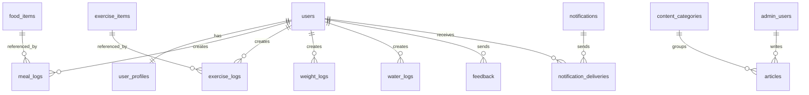

# Fitaru Database Schema

Dokumen ini menjelaskan struktur database MVP untuk aplikasi mobile Fitaru dan admin CMS.

## Tujuan Schema

Schema ini dibuat agar Fitaru punya fondasi data yang rapi untuk:

- Login dan profil user
- Target diet user
- Catatan makan
- Catatan olahraga
- Catatan berat badan
- Catatan air minum
- Konten tips
- Database makanan
- Database olahraga
- Notifikasi
- Feedback user
- Admin CMS

## Rekomendasi Database

Untuk MVP, rekomendasi terbaik:

**Supabase PostgreSQL**

Alasan:

- Cocok untuk aplikasi mobile dan dashboard web admin
- Auth sudah tersedia
- Database relasional lebih enak untuk reporting
- Bisa dipakai untuk CMS
- Mudah dibuat API
- Lebih fleksibel untuk analytics sederhana

Alternatif:

- Firebase Firestore bila ingin cepat untuk mobile-only
- PostgreSQL custom backend bila ingin kontrol penuh

## Entity Relationship Overview



## Core Tables

## 1. users

Menyimpan akun utama user. Jika memakai Supabase Auth, table ini bisa mengikuti `auth.users`, lalu data tambahan disimpan di `user_profiles`.

Kolom:

| Column | Type | Notes |
|---|---|---|
| id | uuid | Primary key |
| email | text | Nullable jika login nomor HP |
| phone | text | Nullable |
| auth_provider | text | google, apple, email, phone |
| status | text | active, suspended, deleted |
| created_at | timestamp | Tanggal daftar |
| updated_at | timestamp | Tanggal update |

## 2. user_profiles

Menyimpan profil dan preferensi user.

Kolom:

| Column | Type | Notes |
|---|---|---|
| id | uuid | Primary key |
| user_id | uuid | Foreign key users.id |
| display_name | text | Nama panggilan |
| gender | text | male, female, other |
| birth_year | int | Untuk menghitung usia |
| height_cm | numeric | Tinggi badan |
| current_weight_kg | numeric | Berat terakhir |
| target_weight_kg | numeric | Target berat |
| goal | text | lose_weight, maintain_weight, gain_muscle, healthier |
| diet_style | text | relaxed, calorie_deficit, high_protein, low_sugar, low_fried, fasting, custom |
| activity_level | text | sedentary, light, active, very_active |
| timezone | text | Default Asia/Jakarta |
| created_at | timestamp |  |
| updated_at | timestamp |  |

## 3. daily_targets

Menyimpan target harian user.

Kolom:

| Column | Type | Notes |
|---|---|---|
| id | uuid | Primary key |
| user_id | uuid | Foreign key users.id |
| water_glasses_target | int | Default 8 |
| exercise_weekly_target | int | Default 3 |
| calorie_target | int | Nullable untuk MVP |
| weigh_in_days | text[] | Contoh: monday, thursday |
| is_calorie_tracking_enabled | boolean | Default false |
| created_at | timestamp |  |
| updated_at | timestamp |  |

## Activity Logs

## 4. meal_logs

Menyimpan catatan makan user.

Kolom:

| Column | Type | Notes |
|---|---|---|
| id | uuid | Primary key |
| user_id | uuid | Foreign key users.id |
| food_item_id | uuid | Nullable, foreign key food_items.id |
| meal_time | text | breakfast, lunch, dinner, snack, drink |
| food_name | text | Input manual user |
| portion_size | text | small, medium, large |
| estimated_calories | int | Nullable |
| photo_url | text | Nullable |
| note | text | Nullable |
| logged_at | timestamp | Waktu makan dicatat |
| created_at | timestamp |  |
| updated_at | timestamp |  |

## 5. exercise_logs

Menyimpan catatan olahraga user.

Kolom:

| Column | Type | Notes |
|---|---|---|
| id | uuid | Primary key |
| user_id | uuid | Foreign key users.id |
| exercise_item_id | uuid | Nullable, foreign key exercise_items.id |
| exercise_name | text | Input manual user |
| duration_minutes | int | Durasi |
| intensity | text | light, medium, heavy |
| estimated_calories_burned | int | Nullable |
| note | text | Nullable |
| logged_at | timestamp | Waktu olahraga |
| created_at | timestamp |  |
| updated_at | timestamp |  |

## 6. weight_logs

Menyimpan riwayat berat badan.

Kolom:

| Column | Type | Notes |
|---|---|---|
| id | uuid | Primary key |
| user_id | uuid | Foreign key users.id |
| weight_kg | numeric | Berat |
| progress_photo_url | text | Nullable |
| note | text | Nullable |
| logged_at | timestamp | Waktu timbang |
| created_at | timestamp |  |

## 7. water_logs

Menyimpan catatan air minum.

Kolom:

| Column | Type | Notes |
|---|---|---|
| id | uuid | Primary key |
| user_id | uuid | Foreign key users.id |
| glasses | int | Jumlah gelas yang ditambahkan |
| logged_at | timestamp | Waktu catat |
| created_at | timestamp |  |

## Reference Data

## 8. food_items

Database referensi makanan yang dikelola admin CMS.

Kolom:

| Column | Type | Notes |
|---|---|---|
| id | uuid | Primary key |
| name | text | Nama makanan |
| category | text | homemade, outside_food, drink, snack, fruit, other |
| default_portion | text | small, medium, large |
| calories_per_portion | int | Estimasi kalori |
| protein_g | numeric | Nullable |
| carbs_g | numeric | Nullable |
| fat_g | numeric | Nullable |
| notes | text | Nullable |
| status | text | active, inactive |
| created_by | uuid | Foreign key admin_users.id |
| created_at | timestamp |  |
| updated_at | timestamp |  |

## 9. exercise_items

Database referensi olahraga yang dikelola admin CMS.

Kolom:

| Column | Type | Notes |
|---|---|---|
| id | uuid | Primary key |
| name | text | Nama olahraga |
| category | text | walking, running, gym, home_workout, cycling, yoga, other |
| default_intensity | text | light, medium, heavy |
| default_duration_minutes | int | Default durasi |
| calories_per_30_minutes | int | Estimasi |
| notes | text | Nullable |
| status | text | active, inactive |
| created_by | uuid | Foreign key admin_users.id |
| created_at | timestamp |  |
| updated_at | timestamp |  |

## Content CMS

## 10. content_categories

Kategori artikel tips.

Kolom:

| Column | Type | Notes |
|---|---|---|
| id | uuid | Primary key |
| name | text | Nama kategori |
| slug | text | Unique |
| description | text | Nullable |
| status | text | active, inactive |
| created_at | timestamp |  |
| updated_at | timestamp |  |

Kategori awal:

- makan-santai
- olahraga-pemula
- kurangi-gula
- meal-prep
- tidur-recovery

## 11. articles

Artikel tips yang tampil di aplikasi.

Kolom:

| Column | Type | Notes |
|---|---|---|
| id | uuid | Primary key |
| category_id | uuid | Foreign key content_categories.id |
| title | text | Judul |
| slug | text | Unique |
| summary | text | Ringkasan pendek |
| content | text | Isi artikel |
| thumbnail_url | text | Nullable |
| status | text | draft, review, published, archived |
| author_id | uuid | Foreign key admin_users.id |
| published_at | timestamp | Nullable |
| created_at | timestamp |  |
| updated_at | timestamp |  |

## Notifications

## 12. notifications

Campaign notifikasi dari admin CMS.

Kolom:

| Column | Type | Notes |
|---|---|---|
| id | uuid | Primary key |
| title | text | Judul notifikasi |
| message | text | Isi pesan |
| target_segment | text | all, active, inactive_7_days, lose_weight, no_meal_today |
| scheduled_at | timestamp | Nullable |
| sent_at | timestamp | Nullable |
| status | text | draft, scheduled, sent, cancelled |
| created_by | uuid | Foreign key admin_users.id |
| created_at | timestamp |  |
| updated_at | timestamp |  |

## 13. notification_deliveries

Riwayat pengiriman notifikasi per user.

Kolom:

| Column | Type | Notes |
|---|---|---|
| id | uuid | Primary key |
| notification_id | uuid | Foreign key notifications.id |
| user_id | uuid | Foreign key users.id |
| delivery_status | text | pending, sent, failed, opened |
| sent_at | timestamp | Nullable |
| opened_at | timestamp | Nullable |
| created_at | timestamp |  |

## Feedback

## 14. feedback

Masukan user dari aplikasi mobile.

Kolom:

| Column | Type | Notes |
|---|---|---|
| id | uuid | Primary key |
| user_id | uuid | Foreign key users.id |
| type | text | bug, suggestion, content_request, other |
| subject | text | Judul feedback |
| message | text | Isi feedback |
| status | text | open, reviewed, resolved, archived |
| admin_note | text | Nullable |
| created_at | timestamp |  |
| updated_at | timestamp |  |

## Admin CMS

## 15. admin_users

Admin yang bisa mengakses CMS.

Kolom:

| Column | Type | Notes |
|---|---|---|
| id | uuid | Primary key |
| name | text | Nama admin |
| email | text | Unique |
| role | text | super_admin, content_admin, support_admin |
| status | text | active, inactive |
| last_login_at | timestamp | Nullable |
| created_at | timestamp |  |
| updated_at | timestamp |  |

## 16. audit_logs

Riwayat aktivitas admin penting.

Kolom:

| Column | Type | Notes |
|---|---|---|
| id | uuid | Primary key |
| admin_user_id | uuid | Foreign key admin_users.id |
| action | text | create, update, delete, publish, suspend |
| resource_type | text | article, food_item, exercise_item, user, notification |
| resource_id | uuid | Nullable |
| metadata | jsonb | Detail perubahan |
| created_at | timestamp |  |

## Dashboard Queries

## Mobile Dashboard

Data yang dibutuhkan:

- Skor konsistensi hari ini
- Jumlah meal log hari ini
- Jumlah gelas air hari ini
- Durasi olahraga hari ini
- Berat terakhir
- Perubahan berat mingguan
- Timeline catatan hari ini

Query konseptual:

```text
Get current user profile
Get daily target
Get meal_logs where logged_at is today
Get water_logs where logged_at is today
Get exercise_logs where logged_at is today
Get latest weight_log
Get weight_log from 7 days ago
```

## Admin Overview Dashboard

Data yang dibutuhkan:

- Total users
- Active users today
- New users this week
- Meal logs today
- Exercise logs today
- Published tips
- Pending feedback
- Top foods this week
- User growth chart

Query konseptual:

```text
Count all active users
Count users active today from activity logs
Count meal_logs today
Count exercise_logs today
Count articles where status = published
Count feedback where status = open
Group meal_logs by food_name for top foods
Group users by created_at for growth chart
```

## Index Recommendations

Index penting:

- `meal_logs(user_id, logged_at)`
- `exercise_logs(user_id, logged_at)`
- `weight_logs(user_id, logged_at)`
- `water_logs(user_id, logged_at)`
- `articles(status, published_at)`
- `articles(slug)`
- `food_items(name)`
- `exercise_items(name)`
- `feedback(status, created_at)`
- `notifications(status, scheduled_at)`

## Row Level Security Notes

Jika memakai Supabase:

- User hanya boleh membaca dan menulis log miliknya sendiri.
- User hanya boleh membaca profil miliknya sendiri.
- User boleh membaca artikel published.
- User boleh membaca food_items dan exercise_items active.
- Admin CMS memakai role khusus untuk mengelola konten dan data referensi.
- Audit log hanya bisa dibaca Super Admin.

## MVP Scope

Untuk MVP, yang wajib dibuat:

1. users
2. user_profiles
3. daily_targets
4. meal_logs
5. exercise_logs
6. weight_logs
7. water_logs
8. food_items
9. exercise_items
10. articles
11. admin_users
12. feedback

Yang bisa menyusul:

1. notification_deliveries
2. audit_logs
3. macro nutrition detail
4. advanced segmentation
5. wearable integration

## Tahap Berikutnya

Setelah schema ini, tahap berikutnya:

1. Membuat SQL migration awal
2. Menentukan API endpoint
3. Membuat struktur project mobile dan admin web
4. Membuat role dan permission admin
5. Membuat backlog development MVP
